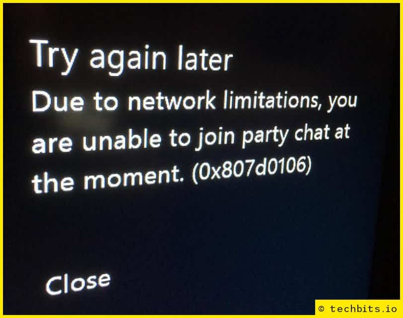
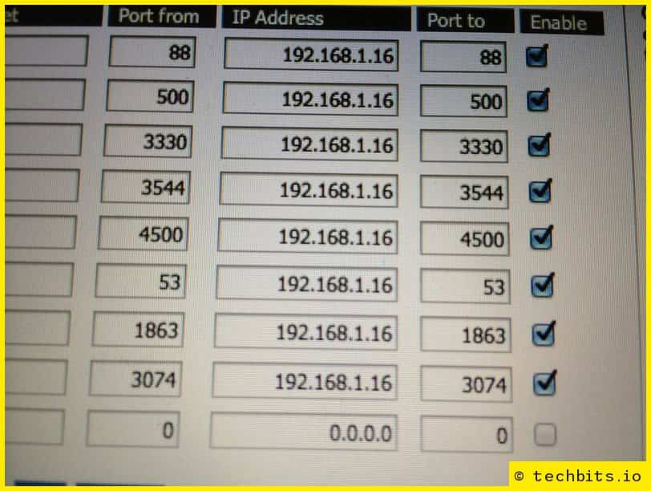

<!--- META
title=How to fix Xbox One multiplayer & chat NAT issues
description=Tips to help you fix your Xbox One NAT issues
author=techbitsio
tags=xbox, networking
header_image=network-switch-ports.jpg
-->

**EDIT: This page *still* gets quite a lot of traffic. Apparently Xbox One NAT issues are fairly commonplace... Please leave a comment if this helps you fix the issue (or even if it doesn't). Or submit an edit and include your own tips.**

As I got started with Titanfall on Friday, it occurred to me that I wasn’t hearing the chatter of other players whilst waiting for games to start.

When I joined a party and tried talking, I kept getting the following error:

> Try again later Due to network limitations, you are unable to join party chat at the moment. (0x807d0106)

I realised that I’d not checked the NAT settings on the Xbox One, so went into the settings ‘app’ -> Network Settings.

In the second column, you’ll see ‘NAT Type:’, and you want this to say ‘Open’. If it says ‘Moderate’ or ‘Strict’, you’ll want to change it (although Moderate is better than Strict).

For games that are hosted on Microsoft servers (I think this is just Titanfall and Forza 5, currently), NAT won’t affect actual gameplay/connectivity, only the peer-to-peer aspects (hence the Live Chat error).

NAT problems tend to be caused where the correct ports are not being opened by the router. Normally, you don’t need to worry about this, because UPnP automatically forwards the ports to the right device.

## Enable UPnP

Login to your router via your web browser (normally `http://192.168.0.1` or `http://192.168.1.1`, but if not, it should say on the router itself). Find the UPnP page (as there are so many different routers, I can’t give specifics on what you’re looking for). It should be fairly obvious as to whether it’s enabled or not. If it *is* enabled, **try clearing the UPnP table**.

When I checked my router, the UPnP was full of lots of old forwardings, including an entry for my Xbox 360. I cleared out the whole table, and checked the Xbox One again… It had dropped from Strict to Moderate. Better, but I was determined now, and really just wanted to get on and play the game.

## UPnP is already on? Try forwarding the ports

Give the Xbox a static IP – Don’t skip this. It will work initially, but after switching it off, the dynamically assigned IP won’t necessarily be the same when you switch back on, taking you back to square one.

Go into Network Settings -> Advanced Settings (for Wired or Wireless, depending on which you’re using).

Then, the easiest way is to find your specific router [here](https://portforward.com/english/applications/portforwarding/XboxOne/). 

As I’m using a router with DD-WRT, there was no guide, so I just added the ports Microsoft specified (apart from port 80 for both UDP and TCP, as I’m already forwarding that elsewhere):

Save and apply the settings (and maybe restart the router), then check the Xbox again. To force a recheck, go back to the Network Settings page (if it already says ‘NAT Type: Open’, great! You’re done. If not, go across to ‘Test Multiplayer Connection’. 

Under ‘Detailed NAT information’, it will just show ‘…’ – Hold LT, RT, LB & RB all at once, and it will test NAT.

## Did it work?

*Your network is behind a port-preserving port-symmetric NAT* - **You’ve still got Strict NAT. Try again.**

*Your network is behind an address-restricted NAT* - **You’ve got Moderate NAT. Better, but keep going.**

*Your network is behind a cone NAT* - **Great, you’ve done it.**

After forwarding the above, I could suddenly hear the thoughts/profanities of everyone in each lobby. Yay?

*Header image by [Brett Sayles](https://www.pexels.com/photo/close-up-photo-of-computer-port-2881227/)*