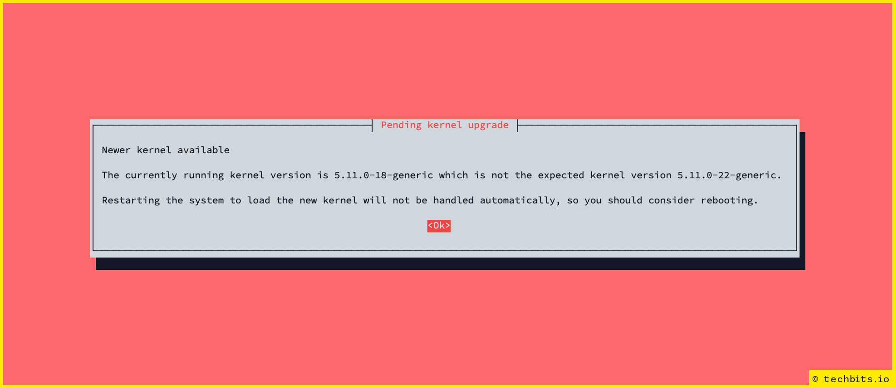
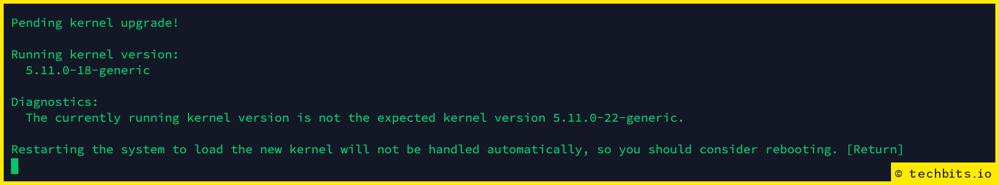

<!--- META
title=Stop needrestart prompting for kernel reboots
publish_date=20210630
description=Stop needrestart from blocking scripts with new kernel reboot 'suggestions'. 
author=techbitsio
tags=Linux
header_image=commandline-processing.png
-->

When creating a system from a clean image using a build script, it can get really annoying if one bit of software blocks the rest of the script from running because it’s prompting you to do something. It's even more annoying when you're specifically using flags to suppress warnings/prompts.

needrestart is a bit of software that will automatically restart services for you (useful!) and tell you when you need to reboot (sometimes useful) because a newer kernel version has been installed.

If you’re manually upgrading a system, the above colourful warning could be a useful message to see, but in the particular script I’m running, the next step is a reboot anyway.

Even by using flags to suppress prompts and messages, you get the following:

One option is to remove needrestart altogether, but that seems overkill when we might benefit from the service restarting features. Instead we can modify the config to hide future kernel version alerts.

For Ubuntu 21.04 the config location defaults to **/etc/needrestart/needrestart.conf**, so edit that and change:

`#$nrconf{kernelhints} = -1;`

to 

`$nrconf{kernelhints} = 0;`

The following one-liner will find the default (commented out) option and replace with the specific `0` value:

`sed -i 's/#$nrconf{kernelhints} = -1;/$nrconf{kernelhints} = 0;/' /etc/needrestart/needrestart.conf`
