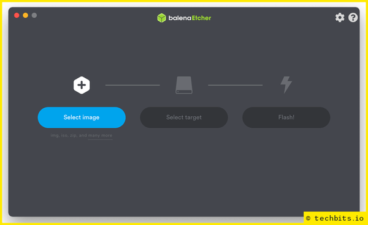
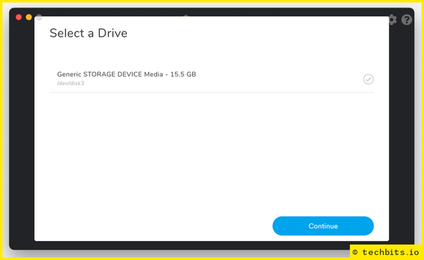
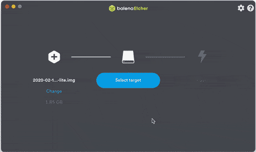
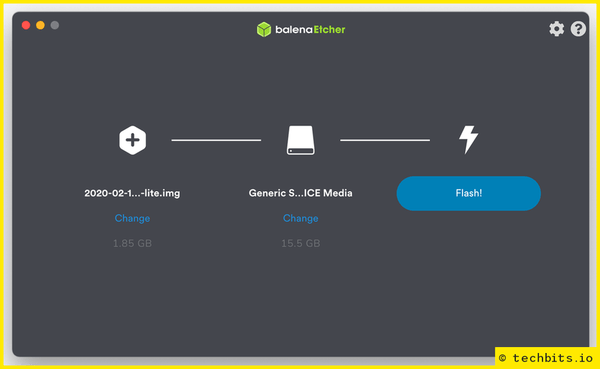

<!--- META
title=Install Raspberry Pi OS and connect to Wi-Fi without a monitor
publish_date=20210703
description=How to install Raspberry Pi OS (Raspbian) and connect to Wi-Fi on a headless Raspberry Pi without having to connect a screen.
author=techbitsio
tags=raspberry pi
header_image=pi-zero.jpg
comments=5
-->

Flashing Raspberry Pi OS (formerly Raspbian) onto an SD card is fairly painless, but with just a couple more steps you can setup Wi-Fi and remote access, preventing the need to connect a monitor and keyboard to set this up for headless systems.

For those who haven't copied a Raspberry Pi OS (or other) operating system image to an SD card, we'll start from the top:

## Download the operating system

As well as the versions provided by the Raspberry Pi Foundation,  [raspberrypi.org](https://www.raspberrypi.org/software/operating-systems/) has some links to other popular RPI operating systems.

For this example, we're using Raspberry Pi OS Lite.

## Download Etcher

There are a few different utilities you can use for creating bootable SD card/removable media, but balenaEtcher is the simplest to use, as well as being fast and reliable. Download it from [balena.io/etcher](https://www.balena.io/etcher/) (there are macOS, Windows and Linux versions) and follow the instructions to install it, then open it.

Once open, choose the Raspberry Pi OS download (leave it in the .zip file - Etcher is fine with this, although other downloads such as NOOBS might need removing from the .zip)



## Connect your micro SD card

For the Lite version of Raspberry Pi OS, you'll need at least a 4GB micro SD card. For the desktop version, you'll need at least 8GB.

Ideally, find a card that is a bit bigger than you need, as you'll probably want space for other software in future.

A fast/high quality card also makes a significant different to using a Raspberry Pi, but that's a discussion for another time!

If you don't have any other cards/USB drives connected to your system, Etcher should recognise the SD card as you connect it. If you want to make sure you're using the right card, you can manually select it by choosing 'Select Target' in the middle (or 'change' if it's automatically selected a card already).



Once you're sure you've selected the right target (and *do* make sure, because this process will erase the card/USB drive), click **Flash!**, enter a password if prompted for one, and wait for Etcher to finish.



This can take 5-10 minutes, and depends on the speed of the card, the card reader, and the size of the operating system image.



By default, Etcher will unmount the card once it's finished flashing, but before we put it into a Pi, remove and reinsert the card so we can set a couple of things.

## Configure Wi-Fi

On the SD card, the main volume will be called `boot`, and in here we want to create a file called `wpa_supplicant.conf` with the contents:

```
ctrl_interface=DIR=/var/run/wpa_supplicant GROUP=netdev
country=GB

network={
 ssid="your_WiFi_ssid"
 psk="yoursupersecretwifipass"
}
```

The country code is a 2 character code. If you're not sure, you can find a list [here](https://en.wikipedia.org/wiki/ISO_3166-1).

If you have a hidden SSID, you'll need to add `scan_ssid=1` into the `network` section:

```
ctrl_interface=DIR=/var/run/wpa_supplicant GROUP=netdev
country=GB

network={
 ssid="hidden-wi-fi"
 psk="yoursupersecretwifipass"
 scan_ssid=1
}
```

If you find yourself configuring Raspberry Pis quite regularly, it's worth keeping a copy of this file on hand ready to copy over, instead of having to recreate it each time.

## SSH access

To enable SSH access, all you need to do is create a file called `ssh` in the `boot` volume (no extension, just *ssh*). The easiest way to do this on macOS or Linux is `touch /Volumes/boot/ssh`. For Windows, use notepad to create a blank file, and just double-check that it hasn't given it a .txt file extension.

## That's it!

Eject the SD card, connect it to your Pi, and you should see it pop up on your network as raspberrypi.local (you may have to login to your router to find the IPs of your network devices if you're unable to access this).

Once you have it, you can SSH to it using the default credentials (username: pi, password: raspberry).

If you have a useful Pi setup tip that I've missed, please leave a comment or submit an edit!

*Header image by [Arthur Reeder](https://pixabay.com/photos/raspberry-pi-zero-linux-board-1904918/)*